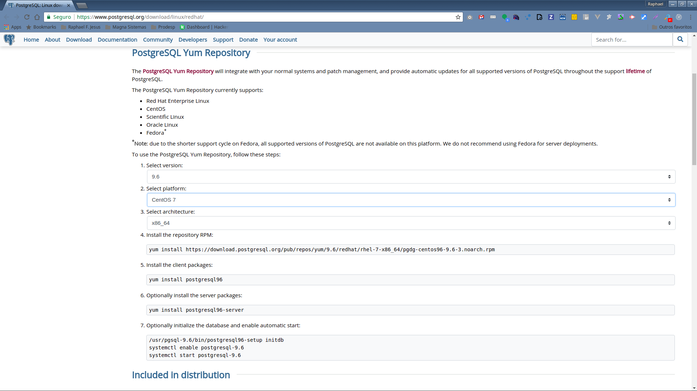
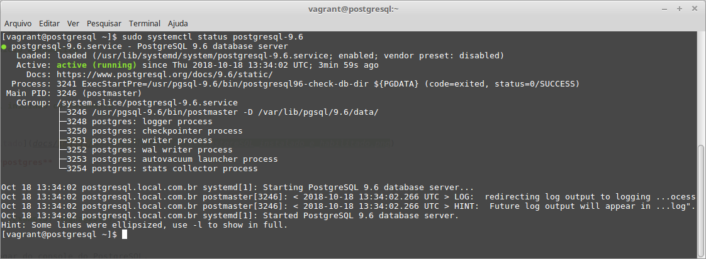
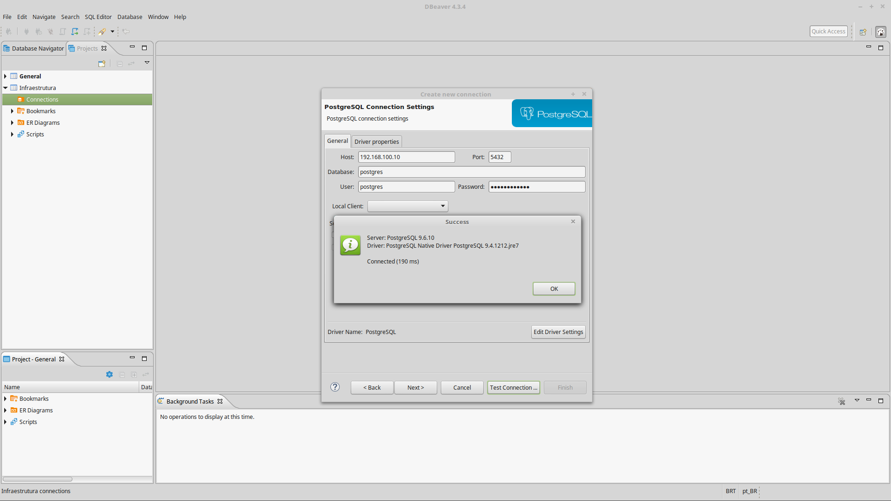
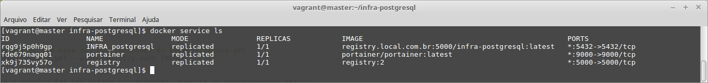
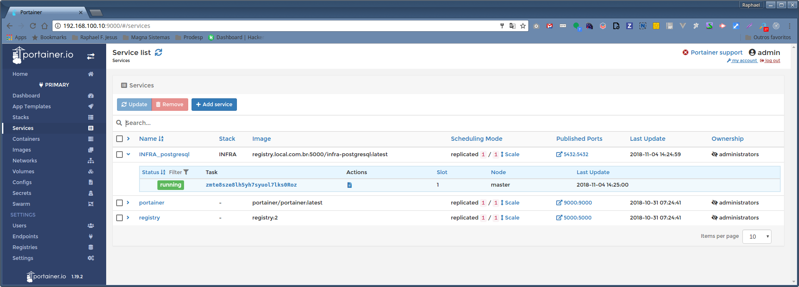
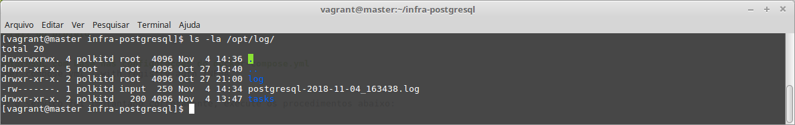
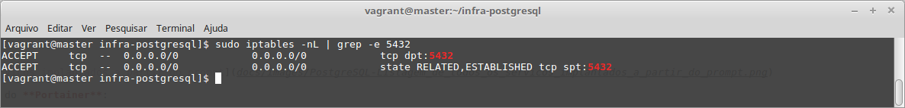

# PostgreSQL - Instalação e Configuração

Este documento tem por objetivo descrever os passos para a instalação e configuração do [PostgreSQL](https://www.postgresql.org/) versão 9.6, ferramenta utilizada para banco de dados.

Tabela de conteúdo
==================

- [Planejamento](#planejamento)
- [Pré-requisitos](#pré-requisitos)
- [Preparação dos Hosts](#preparação-dos-hosts)
- [Instalação e Configuração](#instalação-e-configuração)
  - [Método Tradicional](#método-tradicional)
  - [Método Docker Swarm](#método-docker-swarm)
- [Comandos Úteis](#comandos-úteis)
- [Referências](#referências)

## Planejamento

A instalação será realizada a partir do arquivo de instalação baixado do [repositório PostgreSQL](https://www.postgresql.org/download/) ou do [repositório de imagens Docker](https://store.docker.com/images/postgres), dependendo do método de instalação adotado. Para tal finalidade, a infraestrutura abaixo será utilizada:

**Método de instalação tradicional**

| HOSTNAME | IP PRIVADO | IP PÚBLICO | SISTEMA OPERACIONAL | DESCRIÇÃO |
|----------|------------|------------|---------------------|-----------|
| postgresql.local.com.br | 192.168.100.110 | - | [CentOS 7.3](https://www.centos.org/download/) | Receberá a instalação do PostgreSQL. |

**Método de instalação Docker Swarm**

| HOSTNAME | IP PRIVADO | IP PÚBLICO | SISTEMA OPERACIONAL | DESCRIÇÃO |
|----------|------------|------------|---------------------|-----------|
| master | 192.168.100.10 | - | [CentOS 7.3](https://www.centos.org/download/) | Nó master (líder) do Docker Swarm. |
| slave1 | 192.168.100.11 | - | [CentOS 7.3](https://www.centos.org/download/) | Nó escravo que fará parte do cluster. |
| slave2 | 192.168.100.12 | - | [CentOS 7.3](https://www.centos.org/download/) | Nó escravo que fará parte do cluster. |

>**Nota:** Caso não tenha uma infraestrutura de TI a sua disposição, utilize o [Vagrant](https://www.vagrantup.com/) para provisionar os hosts necessários, adotando o [Vagrantfile](https://www.vagrantup.com/docs/vagrantfile/) disponibilizado [aqui](Vagrantfile) para instalação tradicional ou o Vagrantfile disponível no repositório de [Instalação e Configuração Docker Swarm](https://gitlab.com/raphaelfjesus/infra-docker-swarm/blob/master/Vagrantfile).

## Pré-requisitos

Caso opte pela instalação utilizando o **método tradicional**, pule esta etapa e prossiga para a seção [Preparação dos Hosts](#preparação-dos-hosts) deste documento.

Antes de iniciar a instalação do PostgreSQL no **método Docker Swarm**, certifique-se que as seguintes ferramentas estão disponíveis em seu ambiente:

- [Docker 1.12+](https://docs.docker.com/install/)
- [Git](https://git-scm.com/)

## Preparação dos Hosts

**Método de instalação tradicional**

Antes de iniciar, acesse a página de [download](https://www.postgresql.org/download/linux/redhat/) do PostgreSQL para baixar o repositório RPM:



Após configurar, baixe o repositório RPM configurado para essa distribuição.

```shell
sudo yum install https://download.postgresql.org/pub/repos/yum/9.6/redhat/rhel-7-x86_64/pgdg-centos96-9.6-3.noarch.rpm
```

**Método de instalação Docker Swarm**

Para prosseguir com a instalação e configuração do [PostgreSQL](https://www.postgresql.org/), é necessário ter um cluster [Docker Swarm](https://docs.docker.com/engine/swarm/) configurado. Caso não o tenha, siga as instruções descritas em [Docker Swarm - Instalação e Configuração](https://gitlab.com/raphaelfjesus/infra-docker-swarm).

## Instalação e Configuração

Com todos os [pré-requisitos](#pré-requisitos) atendidos e os [hosts preparados](#preparação-dos-hosts), inicie o processo de instalação do PostgreSQL, selecionando um dos métodos de instalação e executando suas respectivas etapas.

### Método Tradicional

1) Instalação e habilitação do serviço PostgreSQL

```shell
# Instale os pacotes do cliente
sudo yum install postgresql96

# Instale os pacotes do servidor
sudo yum install postgresql96-server

# Inicialize o banco de dados
sudo /usr/pgsql-9.6/bin/postgresql96-setup initdb

# Habilite o serviço do postgresql para início automático
sudo systemctl enable postgresql-9.6

# Inicie o serviço
sudo systemctl start postgresql-9.6

# Verifique se o serviço do PostgreSQL foi iniciado corretamente
sudo systemctl status postgresql-9.6
```



2) Defina a senha para o usuário padrão **postgres**

```shell
# Acesse com usuário postgres
sudo -u postgres psql postgres

# Define uma senha para o usuário postgres (Exemplo: postgres@123)
\password postgres
```

>**Nota:** Utilize ```Ctrl+D``` para deslogar do console do PostgreSQL.

3) Edite os arquivos **pg_hba.conf** e **postgresql.conf** para habilitar o acesso ao banco de dados a partir de clientes (aplicações) executados remotamente.

```shell
# Verifique o local em que a pasta data (PGDATA) foi criada
sudo -u postgres psql postgres
SHOW data_directory;

# Edite o arquivo pg_hba.conf
sudo vi /var/lib/pgsql/9.6/data/pg_hba.conf

# No arquivo pg_hba.conf, modifique os parâmetros responsáveis por controlar os acessos ao banco
local   all all             trust
host    all all 0.0.0.0/0   md5

# Edite o arquivo postgresql.conf
sudo vi /var/lib/pgsql/9.6/data/postgresql.conf

# No arquivo postgresql.conf, modifique o parâmetro abaixo para permitir acesso ao banco a partir de qualquer IP
listen_addresses = '*'

# Reinicie o serviço do PostgreSQL
sudo systemctl restart postgresql-9.6

# Verifique se o serviço do PostgreSQL foi reiniciado corretamente
sudo systemctl status postgresql-9.6
```

>**Nota:** O login no console do postgres pode ser feito executando o seguinte comando: ```psql -d myDb -U myUser -W```

4) Em seguida, libere no firewall a porta 5432 utilizada pelo PostgreSQL, permitindo conexões remotas ao banco de dados:

```shell
# Verifique se o serviço de firewall está em execução
systemctl status firewalld

# Inicie o serviço de firewall caso não esteja em execução
sudo systemctl start firewalld

# Habilite o serviço de firewall para que seja iniciado durante os restarts do servidor
sudo systemctl enable firewalld

# Libere a porta 5432 (utilizado pelo PostgreSQL) para acesso externo ao servidor
sudo firewall-cmd --add-port=5432/tcp --permanent

# Recarregue o serviço do firewall para aplicar as alterações
sudo firewall-cmd --reload

# Verifique se o firewall foi recarregado corretamente
systemctl status firewalld
```

5) Agora, a partir de uma máquina client, tente se conectar no banco de dados criado:



Pronto!

### Método Docker Swarm

1) A partir da máquina **master** do Docker Swarm, execute os comando abaixo para implantar o serviço do PostgreSQL:

```shell
# Clone o repositório "infra-postgresql"
git clone https://gitlab.com/raphaelfjesus/infra-postgresql.git

# Alterne para o diretório raiz do projeto
cd infra-postgresql

# Implante o serviço do PostgreSQL com base nas configurações do docker-compose.yml
docker stack deploy -c docker-compose.yml --with-registry-auth INFRA
```

2) Agora, para confirmar se o serviço foi implantado corretamente, execute os procedimentos abaixo:

A partir do nó **master**:

```shell
# Liste todos os serviços implantados
docker service ls
```



A partir da interface Web do **Portainer**:



3) Em seguida, verifique se os logs foram gerados corretamente no diretório `/opt/log` mapeado como volume em cada nó do cluster.

```shell
# Liste os arquivos contidos no diretório de log mapeado como volume
ls -la /opt/log/
```



4) Agora, libere as portas do PostgreSQL para conexão de máquinas remotas ao cluster Docker Swarm:

```shell
# Verifique se a porta utilizada pelo PostgreSQL já está liberada (se sim, pule para o próximo item)
sudo iptables -nL | grep -e 5432

# Liste a numeração das portas liberadas no firewall
sudo iptables -L --line-numbers

# Libere a porta utilizada para acesso ao banco de dados
sudo iptables -I INPUT <NUMERO> -p tcp --dport 5432 -j ACCEPT

# Salve as regras no arquivo "/etc/sysconfig/iptables" para serem carregadas durante os restarts do servidor
sudo /usr/libexec/iptables/iptables.init save

# Confirme se a porta foi liberada corretamente
sudo iptables -nL | grep -e 5432
```



5) E por fim, a partir de uma máquina fora do cluster Swarm, tente se conectar no banco de dados configurado no arquivo `docker-compose.yml` para comprovar que o serviço foi criado corretamente:

Testando a conexão utilizando o [DBeaver](https://dbeaver.io/):


## Comandos Úteis

- `grep "^[^#;]" $PGDATA/postgresql.conf`: Lista todas as linhas descomentadas do arquivo fornecido **postgresql.conf**
- `sudo systemctl start postgresql-9.6`: Inicia o serviço do PostgreSQL
- `sudo systemctl stop postgresql-9.6`: Para o serviço do PostgreSQL
- `sudo systemctl restart postgresql-9.6`: Reinicia o serviço do PostgreSQL
- `sudo systemctl status postgresql-9.6`: Verifica o status do serviço do PostgreSQL

## Referências

- [PostgreSQL - Documentação](https://www.postgresql.org/docs/9.6/static/index.html)
- [PostgreSQL - Documentação com foco na configuração](https://www.postgresql.org/docs/9.6/static/runtime-config.html)
- [PostgreSQL - Documentação com foco na imagem Docker](https://store.docker.com/docs/images/postgres)
- [PostgreSQL - Artigo sobre alta disponibilidade em contêiners](https://pt.slideshare.net/jkshah/postgresql-high-availability-in-a-containerized-world)

